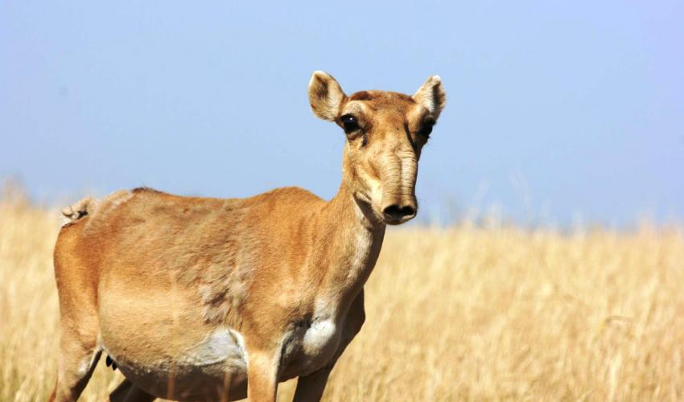

# Vulnerable mammals and their deadly parasites

Parasites can have astonishing effects on their hosts. Just recently, over 200,000 saiga (antelope native to Central Asia) dropped dead over the course of a few days. [Researchers called these events](https://www.theatlantic.com/science/archive/2018/01/why-did-two-thirds-of-this-weird-antelope-suddenly-drop-dead/550676/?utm_source=twb) "unprecedented and unworldly". The killer? A bacterium, _Pasteurella multocida_. {height=250px}

Saiga, a species previously decimated by poaching, are endangered like so many other wild animals. Threatening factors like poaching and habitat might make animals more vulnerable to parasites. Indeed, threatened mammals are more likely to have parasites listed in their species descriptions by the [IUCN](iucnredlist.org). And unfortunately, the number of endangered animals is on the rise. 

Which mammals are most vulnerable to parasites? Which characteristics are associated with vulnerability to parasites? Use this interactive mammal explorer to find out. 

# Why are animals from some taxonomic families especially vulnerable to parasites? 

These interactive plots illustrate how mammals from some taxonomic families are more vulnerable to deadly parasites. In particular, carnivores in the Canidae, Otariidae, and Phocidae were likely to have deadly parasites. In ungulates, many families have a high proportion of threatened species overall but those in Bovidae were most likely to have deadly parasites. 

These families include all major groups of domesticated livestock (dogs, cats, goats, sheep, cattle, and pigs) showing the dangers of cross-species transmission that pets and livestock pose to  closely related wild species. 

# Why are some parasites more threatening? 

TBD.

\newpage

```{r, message=FALSE, warning=FALSE, echo=FALSE}
knitr::opts_chunk$set(cache=TRUE, fig.path = "static-figures/", 
                      warning = FALSE, message=FALSE, echo=FALSE, fig.height = 6) 

library(tidyverse)
library(magrittr)

dat <- read.csv("./data/shiny_data.csv")

dat %<>% filter(Group!="primates")  # just for now bc disease is missing

dat %<>% distinct(HostCorrectedName, .keep_all = TRUE)

```


```{r, eval=FALSE}
# summary of threat variable
table(dat$Threat)
table(dat$ThreatDic)
table(dat$ThreatDic2)

# summary of group
table(dat$Group)

# summary of group x threat
dat %>%
  group_by(Group, ThreatDic2, ThreatDis) %>%
  summarise (n = n()) %>%
  mutate(freq = n / sum(n))

```

```{r}

dat %>%
  filter(ThreatDic==0, ThreatDis==0) %>%
  mutate(type="NonThreatened") -> dfNon
  
dat %>%
  filter(ThreatDic==1, ThreatDis==0) %>%
  mutate(type="ThreatOther") -> dfT

dat %>%
  filter(ThreatDic==1, ThreatDis==1) %>%
  mutate(type="ThreatDisease") -> dfTD

dat %>%
  filter(ThreatDic==1, ThreatDis==1) %>%
  mutate(type="Disease") -> dfD

dat2 <- bind_rows(dfNon, dfT, dfTD, dfD)

dat2 %>% group_by(Group, type) %>%
  tally()

dat %>% 
  group_by(Group) %>% 
  tally()


#write.csv(dat2, "distinct-hosts.csv")

```


```{r}
# threat variable on top 
# and colors should be more intuitive

dat2 %>% 
  group_by(Group, type) %>% 
  tally() %>%
  ggplot(aes(fill=type, y=n, x=Group)) + 
  geom_bar(stat="identity", position = "fill") + 
  labs(y="", fill="")

# filter by group type - host family
# make some sort of automated title
dat2 %>% 
  filter(Group=="carnivores") %>%
  group_by(HostFamily, type) %>% 
  tally() %>%
  ggplot(aes(fill=type, y=n, x=HostFamily)) + 
  geom_bar(stat="identity", position = "fill") + 
  labs(y="", fill="")  + 
  theme(axis.text.x = element_text(angle = 90, hjust = 1))

dat2 %>% 
  filter(Group=="ungulates") %>%
  group_by(HostFamily, type) %>% 
  tally() %>%
  ggplot(aes(fill=type, y=n, x=HostFamily)) + 
  geom_bar(stat="identity", position = "fill") + 
  labs(y="", fill="")  + 
  theme(axis.text.x = element_text(angle = 90, hjust = 1))

# filter by continent
dat2 %>% 
  filter(continent=="North America") %>%
  group_by(HostFamily, type) %>% 
  tally() %>%
  ggplot(aes(fill=type, y=n, x=HostFamily)) + 
  geom_bar(stat="identity", position = "fill") + 
  labs(y="", fill="")  + 
  theme(axis.text.x = element_text(angle = 90, hjust = 1))

dat2 %>% 
  filter(continent=="Africa") %>%
  group_by(HostFamily, type) %>% 
  tally() %>%
  ggplot(aes(fill=type, y=n, x=HostFamily)) + 
  geom_bar(stat="identity", position = "fill") + 
  labs(y="", fill="")  + 
  theme(axis.text.x = element_text(angle = 90, hjust = 1))

# filter by mass
# 0-20 20-60 60+ 
dat2 %>% 
  filter(!is.na(massKG)) %>%
  mutate(mass2=ifelse(massKG<75, 0, 1)) %>%
  group_by(mass2, type, Group) %>% 
  tally() %>%
  ggplot(aes(fill=type, y=n, x=factor(mass2))) + 
  geom_bar(stat="identity", position = "fill") + 
  labs(y="", fill="")  + 
  facet_grid(Group ~ .) +
  theme(axis.text.x = element_text(angle = 90, hjust = 1))

# filter by home range
# 0-
dat2 %>% 
  filter(!is.na(hostHomeRange)) %>%
  mutate(range2 = ifelse(log(hostHomeRange) < 2, 0, 1)) %>%
  group_by(range2, type, Group) %>% 
  tally() %>%
  ggplot(aes(fill=type, y=n, x=factor(range2))) + 
  geom_bar(stat="identity", position = "fill") + 
  labs(y="", fill="")  + 
  facet_grid(Group ~ .) +
  theme(axis.text.x = element_text(angle = 90, hjust = 1))

```


